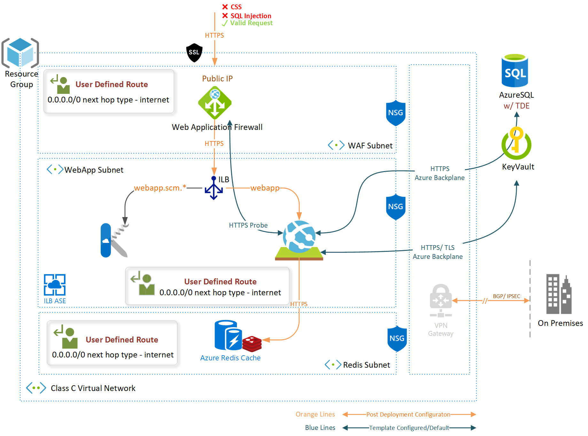

# NIST 800-66 Reference PaaS Blueprint Template using ASE

## Contents

- [Solution Overview](#solution-overview)
	- [NIST 800-66 Based Assurance Framework Azure PaaS](#nist-800-66-based-assurance-framework-for-azure-blueprint-deployment))
	- 
- [Solution Design and Deployed Resources](#soution-design-and-deployed-resources)
	- [Architecture](#)
	- [Deployed Azure Resources](#)
		- [Resource Provider 1]
		- [Resource Provider 2]
		- [Resource Provider 3]
	- [Security](#)
		- [Virtual Network](#)
		- [WAF - Application Gateway](#)
		- [ILB ASE w/ Web Apps](#)
		- [ILB ASE w/ Api Apps](#)
		- [Redis Cache](#)
		- [Azure SQL](#)
		- [Key Vault](#)
- [NIST 800-660 Security Compliance Matrix](#nist-800-66-security-matrix-compliance)

To be filled in by Azure Cloud Health & Security Engineering

- [Deployment Guide](#deployment-and-configuration-activities) 
	- [Configuration Activities](#)
		- [Prefix Value and Tags](#)
		- [Prefix Value and Tags](#)
	- [Deployment Process](#deployment-process)
	- [PowerShell Deployment](#optional-powershell-deployment)

- [Cost](#cost)

## Solution Overview

This template deploys a NIST 800-66 compliant secure baseline to provision a highly secure platform as a service environment that includes Azure App Service Environment with an ILB, Web App, API Apps, Redis Cache Cluster, Web Application Gateway with WAF in Prevention Mode, Azure SQL and a locked down environment with restricted access and communication between services and subnets as described in the security section below.

### NIST 800-66 Based Assurance Framework for Azure PaaS Blueprint Deployment

Lorem epsum.

## Solution Design and Deployed Resources


### Architecture
This diagram displays an overview of the solution



### Security

#### Network

#### Passwords & Secrets

## NIST 800-66 Security Compliance Matrix

 Security Control| Azure Configuration | Responsibility
  ---|---|---
Control 1 | Mapping | Azure
Control 2 | Mapping | Customer 

## Deployed Azure Resources

### VNET
[Microsoft.Networks]
+ **[/virtualNetworks]**: [1 VIrtual Network and 4 Subnets]

### Application Gateway
[Microsoft.Web]
+ **[Resource type 3A]**: [Description Resource type 3A]
+ **[Resource type 3B]**: [Description Resource type 3B]

### Redis Cache
[Microsoft.Cache]
+ **[Redis]**: [Description Resource type 3A]

### ILB ASE - Web App
[Microsoft.Web]
+ **[/hostingEnvironments]**: [Description Resource type 2A]
+ **[/serverFarms]**: [Description Resource type 2A]
+ **[/]**: [Description Resource type 2A]

### ILB ASE - API App
[Microsoft.Web]
+ **[/hostingEnvironments]**: [Description Resource type 2A]
+ **[/serverFarms]**: [Description Resource type 2A]
+ **[/]**: [Description Resource type 2A]

### Azure SQL
[Microsoft.Database]
+ **[Resource type 3A]**: [Description Resource type 3A]
+ **[Resource type 3B]**: [Description Resource type 3B]

### Azure KeyVault
[Microsoft.KeyVault]
+ **[/vaults]**: [Description Resource type 3A]

## Deployment Guide

### Prerequisites

### Deployment Sequence


## Configuration Values

  Resource | Parameter | Configuration
  ---|---|---
  All | All | **No spaces or special characters. Lower case alphabets and numbers only. Adding special characters will break deployment for Azure SQL.**
  All | Prefix | Prefix name for the entire solution. Prepended to all resource names. Keep it short (4-6 characters). Lower case alphabets and numbers only. No spaces or special characters.

## Deployment steps
You can either click the "deploy to Azure" button at the beginning of this document or deploy the solution from PowerShell with the following PowerShell script.

``` PowerShell
# Login to your subscription
Login-AzureRmAccount

# Variables, replace these with your own values
$ResourceGroupLocation = "West Europe"
$ResourceGroupName = "MyResourceGroup"
$RepositoryPath = "https://raw.githubusercontent.com/marcvaneijk/arm/master/200-nested/200-template/"

# Variables, used for constructing the required values
$TemplateFile = $RepositoryPath + "azuredeploy.json"
$TemplateParameterFile = $RepositoryPath + "azuredeploy.parameters.json"
$DeploymentName = (Get-ChildItem $TemplateFile).BaseName + ((get-date).ToUniversalTime()).ToString('MMddyyyyHHmmss')

# Create new Resource Group
New-AzureRmResourceGroup -Name $ResourceGroupName -Location $ResourceGroupLocation

# New Resource Group Deployment
New-AzureRmResourceGroupDeployment -Name $DeploymentName -ResourceGroupName $ResourceGroupName -TemplateFile $TemplateFile -TemplateParameterFile $TemplateParameterFile
```
## Modifying the Templates

## Usage

#### Connect
[How to connect to the solution]
#### Management
[How to manage the solution]

## Cost

You are responsible for the cost of the Azure services used while running this NIST 800-66 reference PaaS deployment template for ASE. There is no additional cost for using this template. The Azure Resource Manager template for this NIST 800-66 reference PaaS deployment for ASE includes configuration parameters that you can customize. Some of these settings will affect the cost of deployment. For cost estimates, see the pricing pages for each AWS service you will be using or the [Azure Calculator](https://azure.microsoft.com/en-us/pricing/calculator/) or the [Azure Channel Pricing Calculator](https://azure.microsoft.com/en-us/pricing/calculator/) if you are an enterprise customer with an ELA. Prices are subject to change.

## Authors

+ Dustin Paulson, Premier Field Engineer, Microsoft
+ Jerad Berhow, Premier Field Engineer, Microsoft
+ Mayur Shintre, Principal Architect, Microsoft

`Tags: [Microsoft, Azure, NIST, 800-66, Compliance, ARM, Templates, PaaS, ASE]`